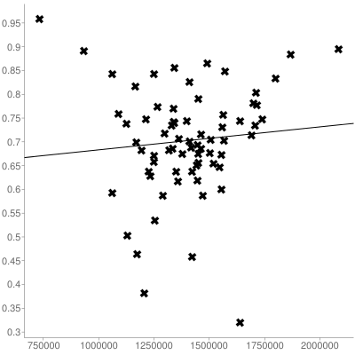

# Image Memorability and Social Media Likes

I was intrigued by the news headline that ["Scientists have uncovered exactly what makes a photo memorable"](https://www.washingtonpost.com/news/innovations/wp/2015/12/29/forget-beautiful-sunrises-embrace-absurdity-heres-how-to-take-memorable-photos/) and wanted to better understand whether this [LaMem](http://memorability.csail.mit.edu/index.html) algorithm might be able to predict the number of social media "likes" for a particular image.

Fortunately, it's relatively fast to use the Instagram API and the LaMem API to get output data that can be graphed to better understand the correlation between social media "likes" and the "memscore". Check out the [Python code](lamem-instagram.py).

I have not found any strong correlation between image memorability (as defined by the LaMem algorithm) and # of social media likes.

Here's the output based on [70 data points](output-images-only.txt) from Taylor Swift (the most popular Instagram celebrity):

* X axis = Number of Instagram Likes
* Y axis = MemScore from the LaMem algorithm

* Correlation coefficient (r): **0.0933** ([very low](https://en.wikipedia.org/wiki/Pearson_product-moment_correlation_coefficient#Interpretation))

(Linear regression output via http://www.alcula.com/calculators/statistics/linear-regression/.)

